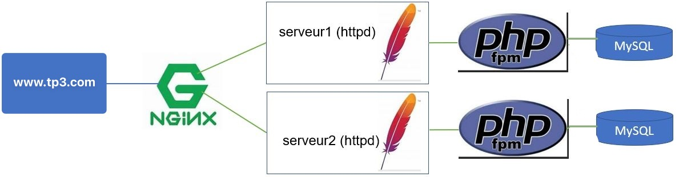

# ISS_TP3-ServiceWeb

## Travail pratique 3 - Mise en place d’un service Web (Docker Compose)
### 2026-06-09

- Faire une installation complète d’un site Web avec équilibrage de charge.
- Utiliser Nginx comme équilibreur/répartiteur de charge (load balancer).
- Utiliser Apache (httpd) comme serveur de contenus.
- Utiliser php-fpm comme FastCGI.
- Utiliser MySQL comme serveur de base de données.

Lien vers la vidéo (réalisée avec Pierre-Alexandre Déry)
https://www.youtube.com/watch?v=fgMnt3uDpSs